# 📊 Análisis Exploratorio de Datos (EDA) - Campañas de Marketing Bancario

**Autora:** Claudia Carim Huayhua Bellido  
**Curso:** Especialización Python for Analytics  
**Año:** 2026  

## Descripción del proyecto

Aplicación interactiva que analiza los factores que influyen en la aceptación de campañas de marketing bancario.

**Contexto:** La efectividad de las campañas cayó del 12% al 8%.

## Links

- **App desplegada:** https://trabajofinal-cchb.streamlit.app/
- **GitHub:** https://github.com/Carim-2000/TRABAJO_FINAL

## Capturas

| Módulo | Captura |
|--------|---------|
| Home | 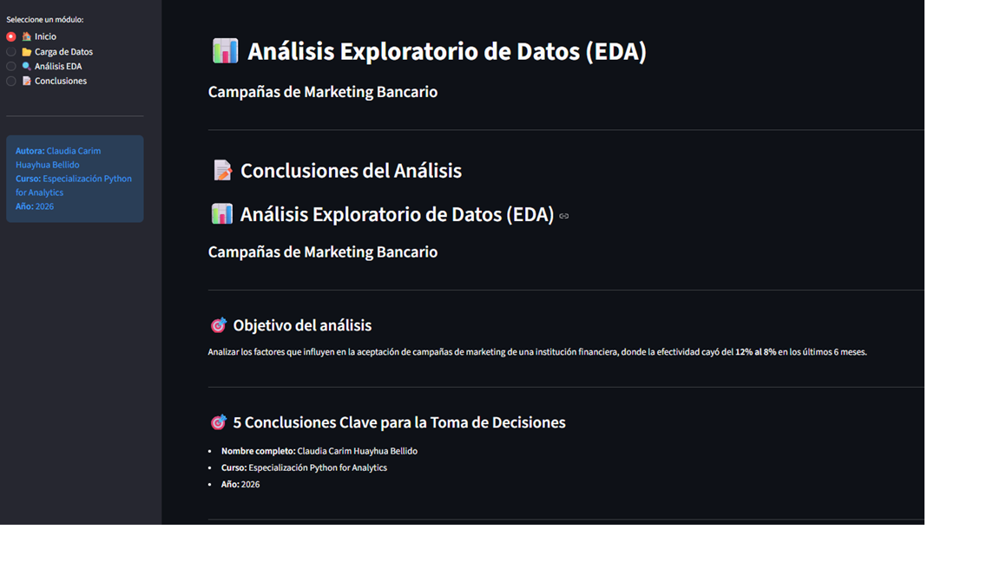 |
| Carga de Datos | 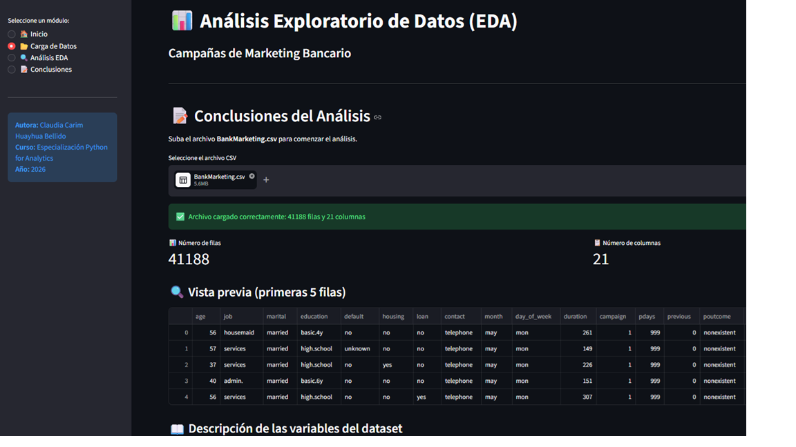 |
| Ítem 1 | 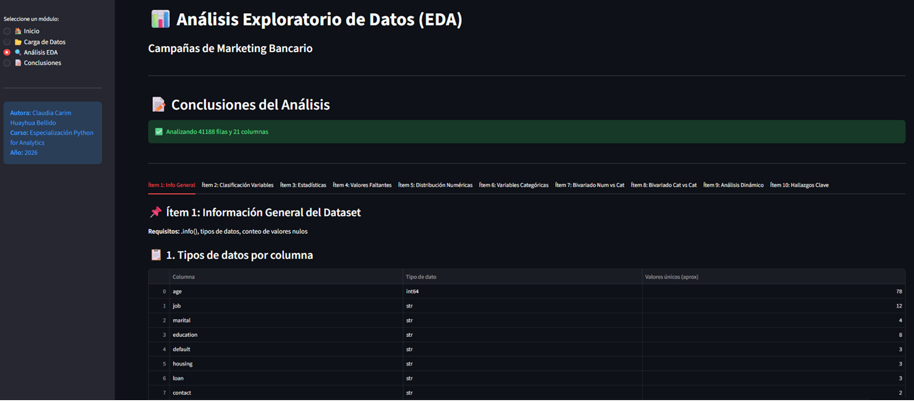 |
| Ítem 2 | 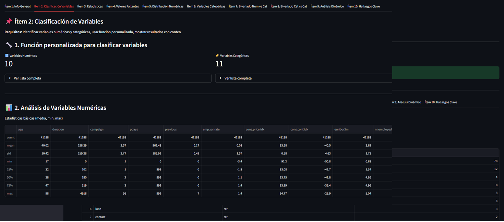 |
| Ítem 3 | 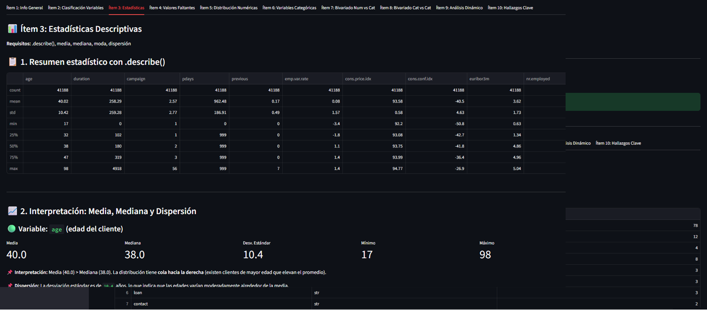 |
| Ítem 4 | 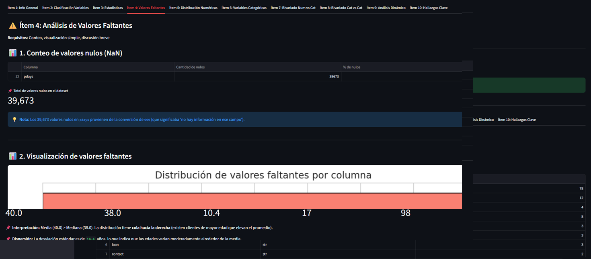 |
| Ítem 5 | 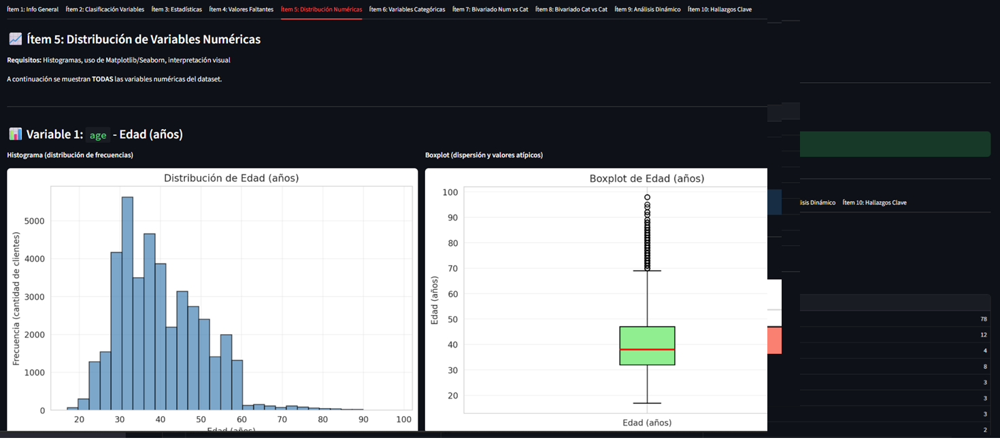 |
| Ítem 6 | 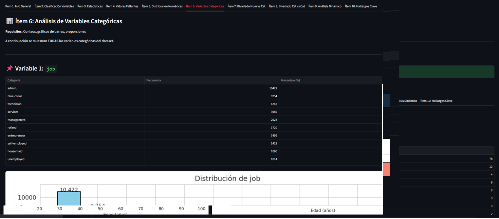 |
| Ítem 7 | 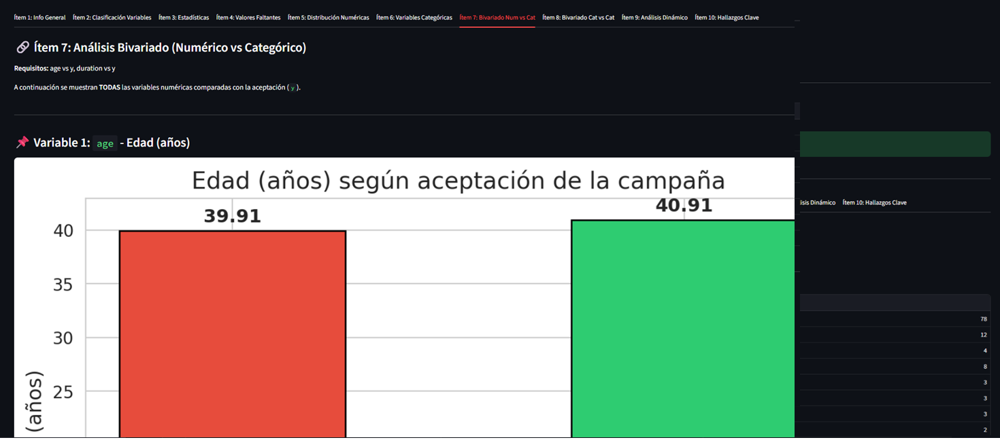 |
| Ítem 8 | 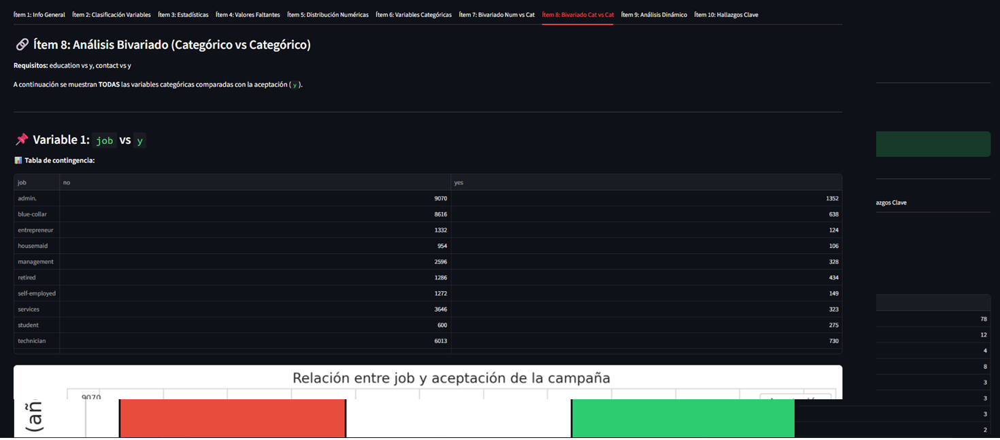 |
| Ítem 9 | 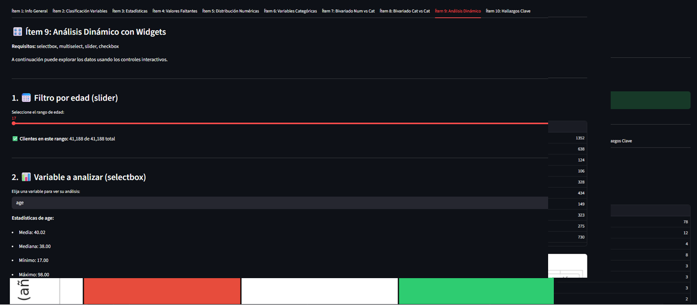 |
| Ítem 10 | 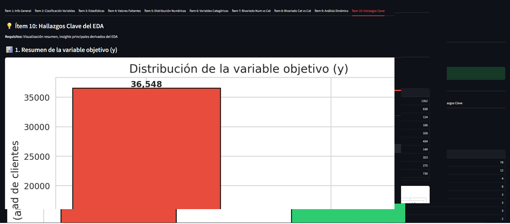 |
| Conclusiones | 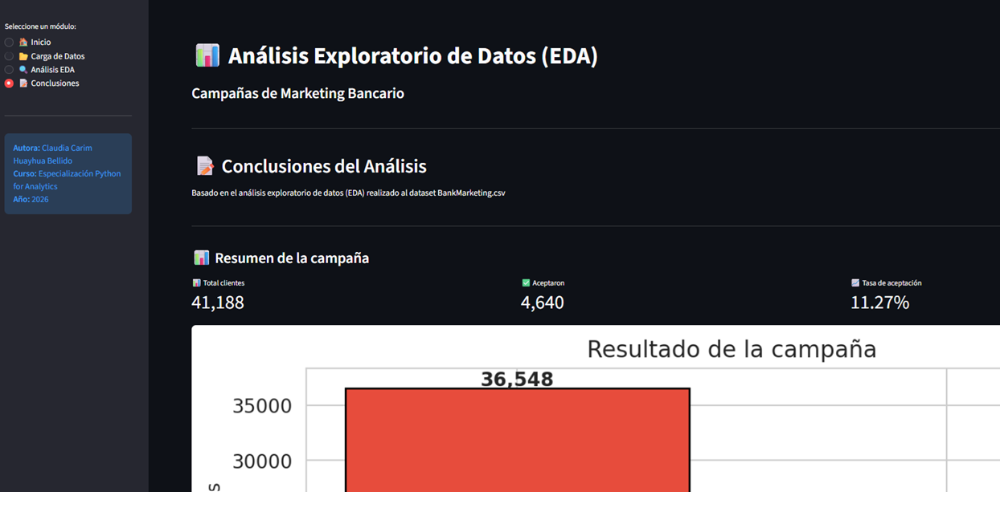 |

## Tecnologías

Python, Streamlit, Pandas, NumPy, Matplotlib, Seaborn, SciPy

## Instrucciones para ejecutar

```bash
git clone https://github.com/Carim-2000/TRABAJO_FINAL.git
cd TRABAJO_FINAL
pip install -r requirements.txt
streamlit run app.py
